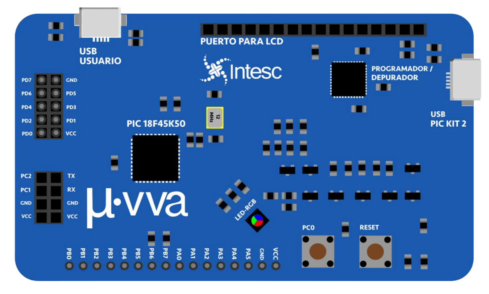
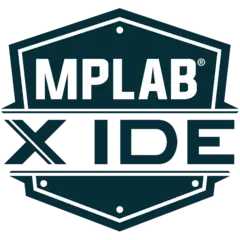
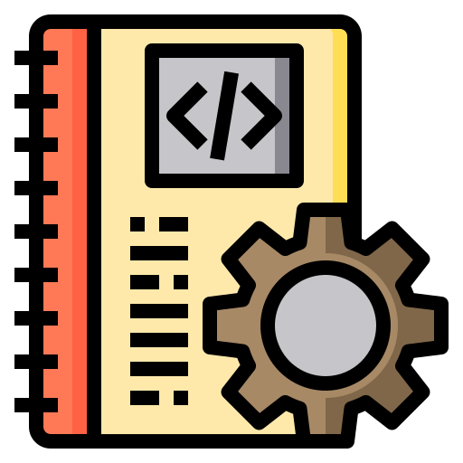

# Miuva

  

  
  
  

---

  
<strong>¿Qué es Miuva?</strong>

   

  **Miuva** es una tarjeta de desarrollo electrónica creada para diseñar proyectos usando un microcontrolador PIC de 8 bits. Está pensada para estudiantes, makers, docentes y desarrolladores que quieren aprender, prototipar, probar periféricos y escribir firmware.

  La tarjeta utiliza como núcleo el **PIC18F45K50** que puede trabajar hasta **48 MHz**, integra periféricos como **USB** y **ADC**, además de que incorpora su propio programador **PICKit2™** en la misma placa. Esto hace mucho más directo el ciclo de escribir, compilar, cargar y volver a probar. En pocas palabras es una tarjeta de desarrollo para conectar, escribir código, probar ideas, equivocarse y aprender.

---

  
<strong>Intro técnica</strong>

   

  Miuva integra un **PIC18F45K50** con arquitectura **RISC de 8 bits**, cristal de **12 MHz** y **PLL** para alcanzar hasta **48 MHz**. También incluye indicadores de alimentación y actividad del programador, además de un **LED RGB de propósito general**, un botón de **reset** y un pulsador adicional para pruebas de entrada digital.

  En conectividad y expansión, la tarjeta ofrece:

  - alimentación de **5 V**
  - **14 pines** de expansión digital para protoboard
  - **10 pines compartidos** con funciones analógicas en puertos A y B
  - un puerto GPIO de **8 bits** conectado directamente al **Puerto D**
  - conector para **LCD 16x2** en modo de 4 bits
  - puerto **RS232** con líneas **TX, RX, GND y VCC**
  - un puerto USB para programación y otro para aplicaciones del usuario, con soporte para modos **HID**, **MSD** y **CDC**
  - **USB Tipo C**

  A nivel físico, la tarjeta está montada sobre una PCB de **dos capas** de aproximadamente **5 x 9 cm**, con una distribución compacta y pensada para ubicar rápido sus bloques principales y poder adaptarla en tus proyectos.

---

  
<strong>Programación y herramientas</strong>

   

  Miuva puede trabajarse en **lenguaje ensamblador** usando **MPLAB X IDE**, en **C** con **MPLAB X C18** y usando herramientas como **CCS PIC C Compiler** y **MikroC**.

  

    
  

  Eso hace que esta tarjeta sea ideal para implementar dos formas de aprendizaje:

  ### Aprender ensamblador

  Si quieres entender de verdad qué está pasando dentro del microcontrolador, aquí puedes trabajar desde registros, puertos, temporización y control directo del hardware.

  ### Aprender C para embebidos

  Si buscas avanzar más rápido y construir ejemplos más grandes, C te permite organizar mejor el código, reutilizar funciones y crecer hacia proyectos con **UART**, **LCD**, **PWM**, **ADC** o **USB** de manera más escalable.

---

  
<strong>Elementos integrados en la tarjeta</strong>

   

  ### LED RGB integrado

  El LED RGB de propósito general está conectado directamente al **Puerto E** del PIC18F45K50:

  - **Verde** → `PORTE0`
  - **Rojo** → `PORTE1`
  - **Azul** → `PORTE2`

  Esto lo vuelve muy práctico para ejercicios iniciales, pruebas rápidas de GPIO, temporización, secuencias de color y depuración visual básica.

  ### Pulsadores

  La tarjeta incluye:

  - un botón de **RESET**
  - un pulsador de propósito general conectado en **RC0**

  ### Expansión

  Para prototipado, Miuva expone:

  - **Puerto A** y **Puerto B** hacia protoboard, incluyendo líneas digitales y funciones analógicas
  - **Puerto D** completo en un header de expansión
  - líneas **TX/RX** y señales del **Puerto C**
  - interfaz dedicada para **LCD 16x2** usando el **Puerto D**

---

  
<strong>¿Qué encontrarás en este repositorio?</strong>

   

  Este repositorio existe para concentrar material útil alrededor de Miuva. Aquí podrás encontrar:

  - ejemplos básicos de arranque
  - prácticas por periférico
  - pruebas de puertos y módulos
  - proyectos completos
  - documentación técnica
  - diagramas y recursos visuales
  - material reutilizable para futuras implementaciones

  La meta es que cualquier persona pueda copiar y pegar los códigos, entender qué hace cada ejemplo, cómo se carga y qué se necesita para reproducirlo.

---

## Documentación

<table>
  <tr>
    <td width="72" align="center">
      
    </td>
    <td>
      <strong>Manual de especificaciones — Rev. J</strong> 
      Información técnica de la tarjeta Miuva, sus características, puertos, conectividad y referencia general de hardware.
        
      
    </td>
  </tr>
</table>

---

---

## Índice

<table>
  <thead>
    <tr>
      <th>Proyecto</th>
      <th>Descripción</th>
      <th>Lenguaje</th>
      <th>Estado</th>
    </tr>
  </thead>
  <tbody>
    <tr>
      <td>
        <a href="./01-hola-mundo"><strong>01 · Hola Mundo</strong></a>
         
        
      </td>
      <td>
        Proyecto inicial para controlar el <strong>LED RGB integrado</strong> de la tarjeta.
        Servirá como punto de arranque para validar compilación, carga de firmware y manejo básico de
        <code>PORTE0</code>, <code>PORTE1</code> y <code>PORTE2</code>.
      </td>
      <td>
        <code>Ensamblador</code> 
        <code>C</code>
      </td>
      <td>
        
      </td>
    </tr>
  </tbody>
</table>

---

## Cómo empezar

La mejor forma de introducirse a Miuva es simple:

1. **Clona o descarga** este repositorio.
2. Revisa el manual en `assets/docs/`.
3. Entra al proyecto que te interese.
4. Compila o carga el ejemplo.
5. Modifícalo.
6. Rómpelo.
7. Arréglalo.
8. Aprende en el proceso.

Si vienes empezando, lo más lógico es arrancar con `01-hola-mundo` y asi sucesivamente ir avanzando por el indice de proyectos.

---

## ¿Cómo puedo colaborar?

Si tienes una Miuva, quieres probar ideas y te interesa aportar, eres bienvenido.

Puedes colaborar de varias formas:

- Corrigiendo errores en ejemplos o documentación
- Proponiendo nuevos ejercicios
- Subiendo prácticas en ensamblador
- Subiendo prácticas en C
- Documentando conexiones o resultados de pruebas
- Mejorando explicaciones para personas que van empezando
- Reportando comportamientos raros del hardware o del flujo de carga

Si quieres colaborar, la forma más simple es:

1. Haz un **fork** del repositorio o clónalo localmente.
2. Crea o mejora un proyecto dentro de su carpeta correspondiente.
3. Asegúrate de dejar un `README.md` claro dentro de ese proyecto.
4. Explica qué hace, cómo se compila, cómo se carga y qué conexiones usa.
5. Envía un **pull request** con una descripción decente de lo que agregaste o corregiste.

Si no quieres mandar código todavía, también ayuda muchísimo:

- Abrir un **issue**
- Proponer ideas de proyectos
- Señalar errores en documentación
- Sugerir mejoras de estructura
- Compartir resultados de pruebas

La colaboración aquí no se trata solo de subir código. También se trata de hacer que el repo sea más claro y más útil.

---

## Contacto

Si tienes dudas sobre la tarjeta, quieres proponer una mejora, compartir un proyecto o simplemente conectar conmigo, aquí te dejo dónde encontrarme.

  
  
  

  Este repositorio también está hecho para aprender, experimentar y compartir. Si algo de aquí te sirvió, úsalo, adáptalo y llévalo más lejos.

